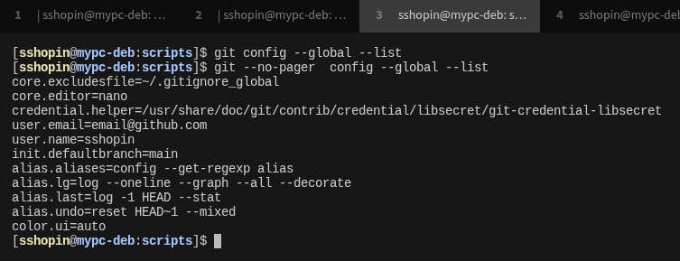
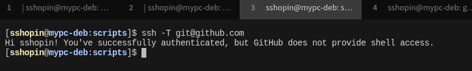
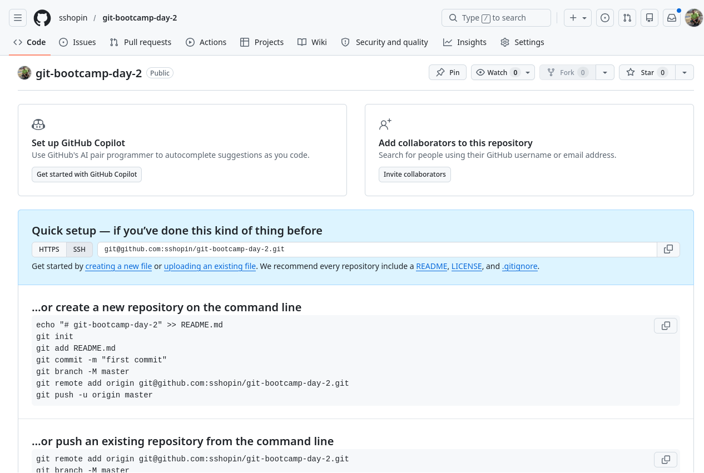
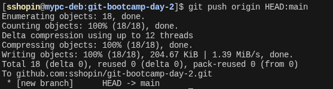
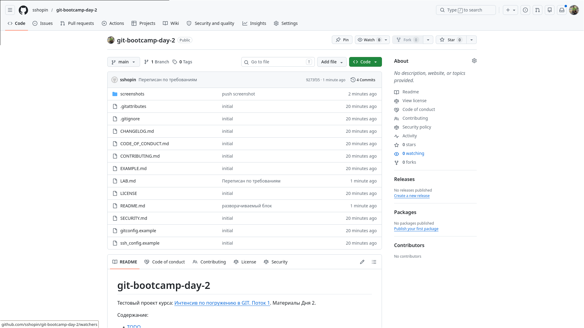

# LAB — день 2

Отчёт о выполнении домашнего задания дня 2 в рамках курса ["Интенсив по погружению в GIT"](https://slurm.io/git-intensive): настройка `gitconfig` и SSH, создание публичного репозитория, наполнение его служебными и стандартными файлами.

## Содержание

- [LAB — день 2](#lab--день-2)
  - [Содержание](#содержание)
  - [Настройка gitconfig](#настройка-gitconfig)
  - [SSH-ключ и подключение к GitHub](#ssh-ключ-и-подключение-к-github)
  - [Создание репозитория](#создание-репозитория)
  - [Служебные файлы](#служебные-файлы)
    - [`.gitignore`](#gitignore)
    - [`.gitattributes`](#gitattributes)
  - [Стандартные файлы и выбор лицензии](#стандартные-файлы-и-выбор-лицензии)
    - [Почему именно эта лицензия](#почему-именно-эта-лицензия)
  - [Markdown](#markdown)
  - [Финальный пуш](#финальный-пуш)

## Настройка gitconfig

Заданы параметры: 
- `core.editor` - установка редактора по умолчанию;
- `core.excludesfile` - глобальный список игнорируемых файлов;
- `credential.helper` - хранение секретов;
- user.email, user.name - имя и email пользователя;
- `init.defaultbranch` - имя ветки по умолчанию;
- `pager.*` - отключить pager для ряд команд;
- `color.ui` - зафиксировать цветной режим;
- алиасы: aliases, lg, last, undo.

Скриншот вывода `git config --global --list`:



Полный фрагмент моего конфига — в файле [`gitconfig.example`](gitconfig.example).

## SSH-ключ и подключение к GitHub

Алгоритм `ed25519` с хранением ключа на yubikey (тип ключа ed25519_sk). Passphrase включен, user presence включен.
`~/.ssh/config`:
```
Host github.com
# сбрасываем другие форвадинги, которые не нравяися github
    ClearAllForwardings yes
    HostName github.com
#    HostName ssh.github.com
#    Port 443
    User git
# путь к файлу ключа
    IdentityFile ~/.ssh/id_ed25519_sk_git_key1
# добавляем ключи в агент
    AddKeysToAgent yes
```
Порт 443 также пришлось использовать, т.к. ssh-сессия с hithub обрывается у провайдера.

Скриншот ответа GitHub на `ssh -T git@github.com`:



Фрагмент моего `~/.ssh/config` — в файле [`ssh_config.example`](ssh_config.example).

## Создание репозитория

Видимость - public, создан как пустой. Всё собрано локально и запушено потом.

Скриншот свежесозданного репозитория:



## Служебные файлы

### `.gitignore`

Стек: `<Python | visualstudiocode | jupyter notebooks>`. Добавлен `*.swp` для работы в bash. Выбрал, потому что захотелось здесь выбрать такой набор инструментов. За основу взял шаблон с `https://www.toptal.com/developers/gitignore/api/<stack>` и [FIXME: добавил/убрал такие-то правила].


### `.gitattributes`

Минимум — `* text=auto` для нормализации переносов строк между macOS/Linux и Windows. Дополнительные правила:

```text
*.png binary
*.svg binary
*.jpg binary

*.ipynb diff=jupyternotebook
*.ipynb merge=jupyternotebook
```

Настроен nbdime в .gitattributes и .gitconfig.

## Стандартные файлы и выбор лицензии

В корне лежат:

- [`README.md`](README.md) — визитка проекта.
- [`CHANGELOG.md`](CHANGELOG.md) — формат Keep a Changelog.
- [`LICENSE`](LICENSE) — выбранная лицензия (MIT).
- [`CONTRIBUTING.md`](CONTRIBUTING.md) — как контрибьютить.
- [`CODE_OF_CONDUCT.md`](CODE_OF_CONDUCT.md) — Contributor Covenant.
- [`SECURITY.md`](SECURITY.md) — политика раскрытия уязвимостей.

### Почему именно эта лицензия

Выбор лицензии, т.к. хотел разрешить любое использование данного проекта.

## Markdown

В этом отчёте и в `README.md` использованы:

- заголовки `H1`/`H2`/`H3`;
- оглавление в начале со ссылками на якоря;
- блоки кода с подсветкой (`bash`, `JSON`);
- сворачиваемый блок;
- ссылки на внешние URL.

## Финальный пуш

Пушили явно на main: `git push origin HEAD:main`. Простой push дал ошибку, т.к. репозитории создаю с веткой master: 
```
fatal: The upstream branch of your current branch does not match
the name of your current branch.  To push to the upstream branch
on the remote, use
```
Исправил `git branch --set-upstream-to=origin/main main`, после чего `git push` работает нормально.

Публичный статус репозитория подтверждает тегов `Public` в названии на github.

Терминал с пушем:



Главная страница репозитория после пуша:




